# 🚦 TrafficPulse

**Real-time AI-powered traffic cascade prevention system for Bangalore's Outer Ring Road (Silk Board → KR Puram).**

TrafficPulse uses predictive AI and graph theory to detect cascading traffic failures **30 minutes before they happen** — saving cities billions in lost productivity and protecting lives.

---

## 🖥️ Screenshots & Features

### Landing Page

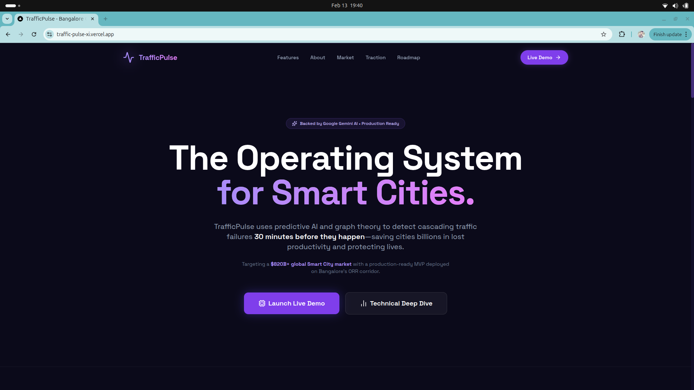

> A stunning, investor-ready landing page showcasing TrafficPulse as "The Operating System for Smart Cities" — powered by Google Gemini AI.

---

### 📊 Real-Time Dashboard — KPIs & Cascade Alerts

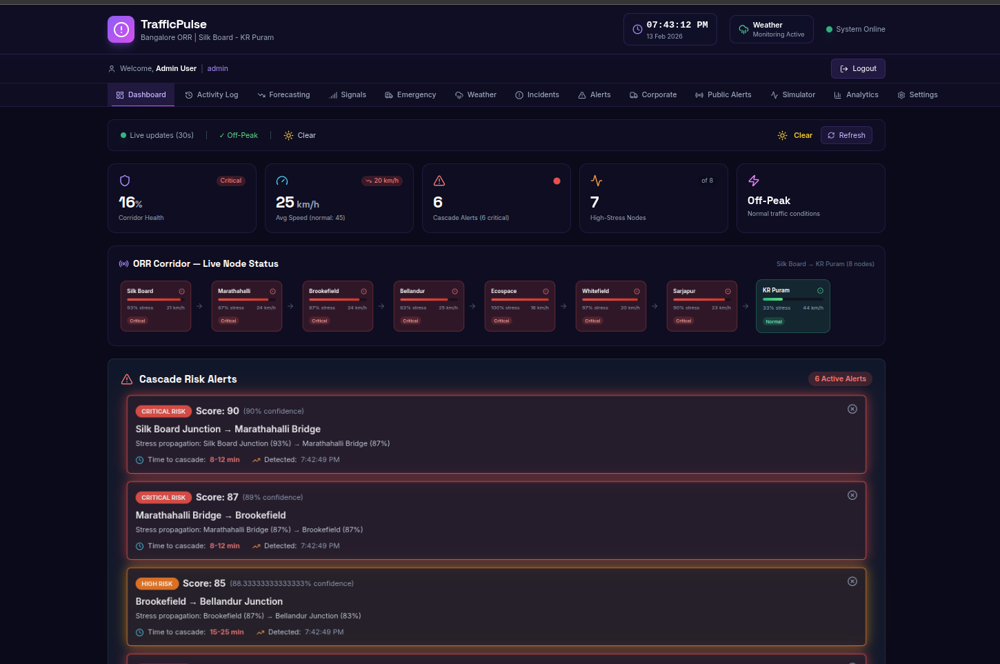

> **Live command center** with real-time corridor health score, average speed, cascade alert count, and node stress levels. Active cascade risk alerts with confidence scores, propagation paths, and time-to-collapse estimates. Live updates every 30 seconds.

---

### 🗺️ Dashboard — Live Map, Charts & System Health

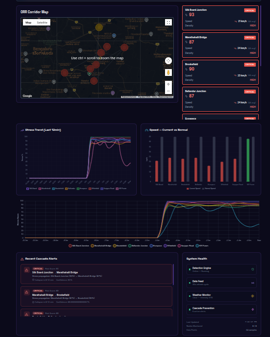

> **Interactive Google Maps heatmap** showing live traffic density across all 8 ORR junctions. Includes stress trend charts (last 12 mins), speed comparison (current vs. normal), recent cascade alerts, and a system health monitor tracking all detection engines.

---

### 📡 Signal Management Console

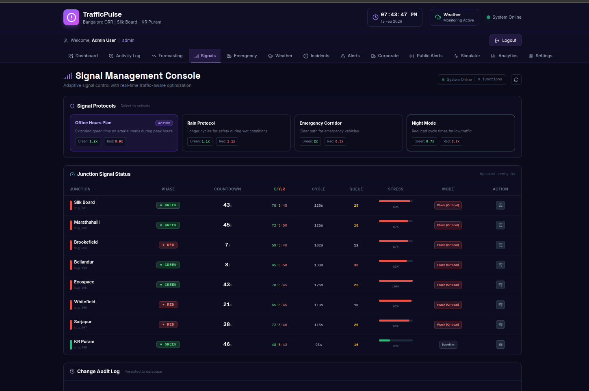

> **Adaptive signal control** with smart protocols (Office Hours, Rain Protocol, Emergency Corridor, Night Mode). Real-time junction signal status showing phase, countdown, cycle time, queue length, and stress levels for every junction from Silk Board to KR Puram.

---

### 🚑 Emergency Command Center

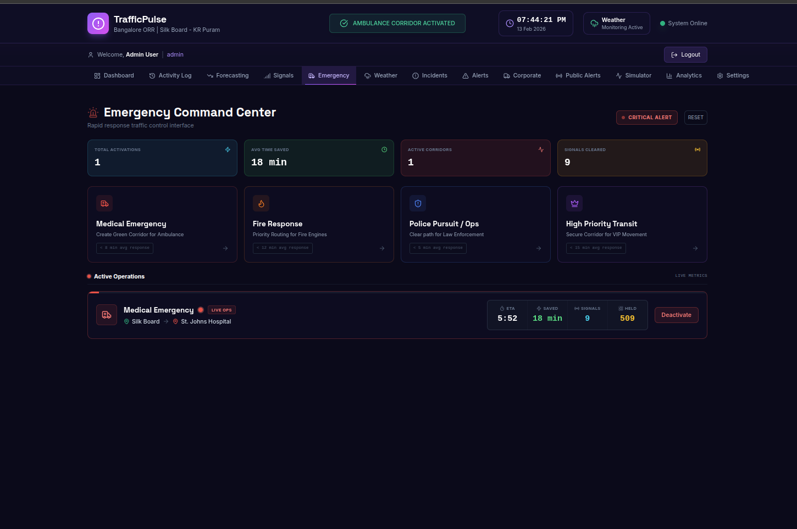

> **Rapid response interface** for Medical Emergencies, Fire Response, Police/Ops, and High Priority Transit. Shows active corridor operations with real-time ETA, distance, signals cleared, and speed — with one-click corridor activation and deactivation.

---

### 🌦️ Weather Impact Analysis

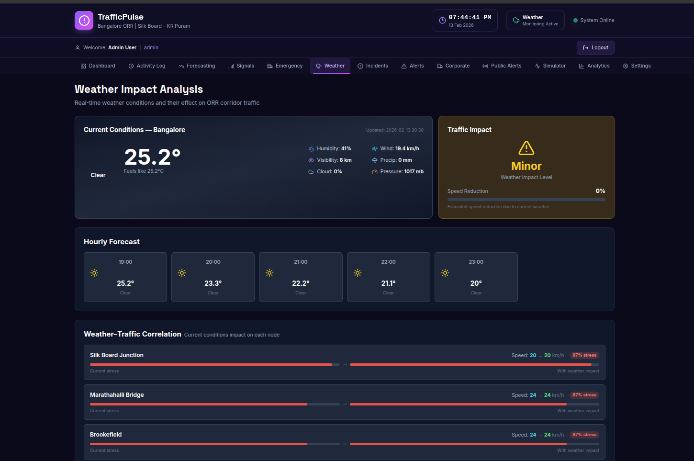

> **Real-time weather monitoring** with current conditions, hourly forecasts, and weather-traffic correlation for every node. Tracks humidity, wind speed, visibility, cloud cover, and pressure — and calculates the traffic impact level (Minor/Moderate/Severe) with speed reduction estimates.

---

### 🚧 Incident Impact Analyzer

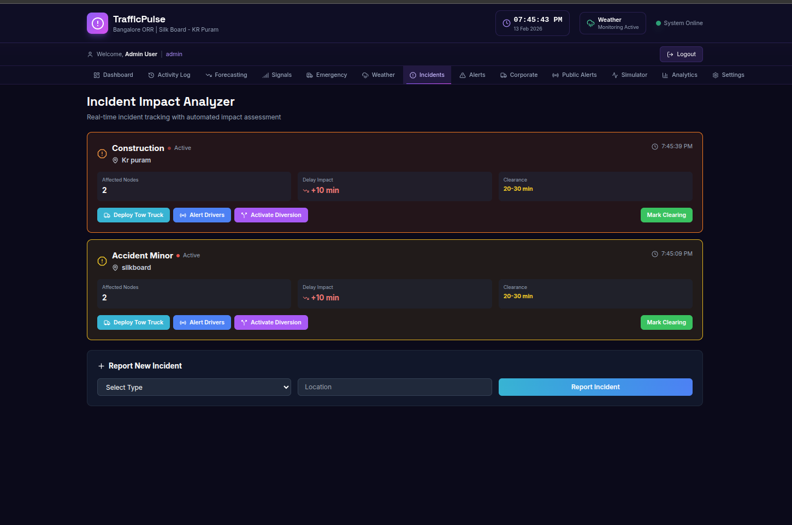

> **Live incident tracking** with automated impact assessment. Shows affected nodes, delay impact, clearance time, and one-click actions: Deploy Tow Truck, Alert Drivers, Activate Diversion. Includes an incident reporting form for real-time field updates.

---

### 🏢 Corporate Command Center

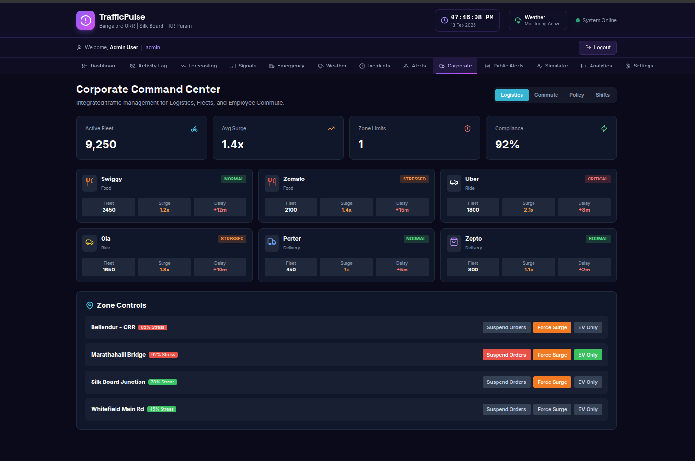

> **Enterprise fleet management** with Logistics, Commute, Policy, and Shifts tabs. Monitors major companies (Swiggy, Zomato, Uber, Ola, Porter, Zepto) with fleet size, surge levels, and zone compliance. Zone controls for suspending orders, forcing surge pricing, or enabling EV-only mode.

---

### 📢 Public Alert System

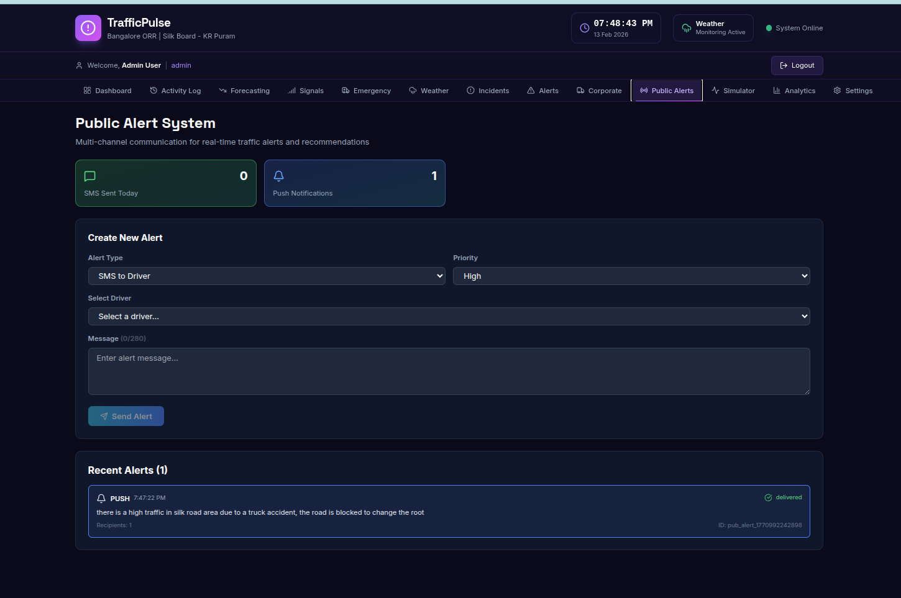

> **Multi-channel communication hub** for broadcasting real-time traffic alerts via SMS, Email, Push Notifications, and Twitter. Tracks sent alerts with delivery status and supports driver-specific or public-wide targeting.

---

### 🧪 Traffic Scenario Simulator

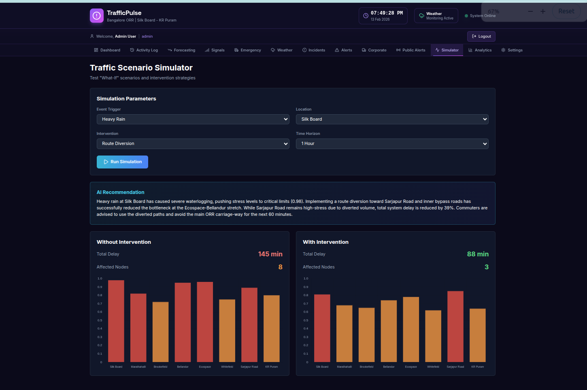

> **"What-if" scenario testing** with configurable event triggers (Heavy Rain, Accident, etc.), locations, interventions, and time horizons. **AI-powered recommendations** from Google Gemini — compares total delay and affected nodes with vs. without intervention using side-by-side bar charts.

---

### 📈 Analytics Dashboard

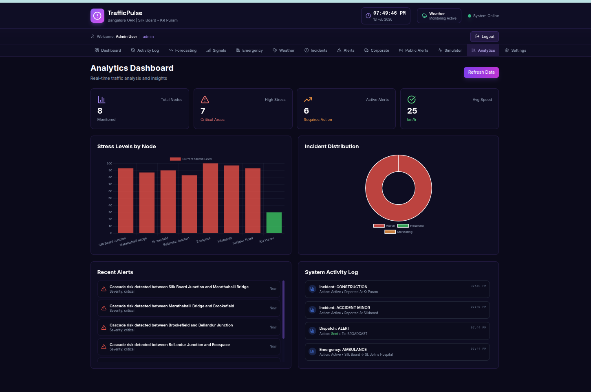

> **Comprehensive analytics** with total nodes monitored, critical areas, active alerts, and average speed. Includes stress level bar charts per node, incident distribution donut chart, recent alerts feed, and system activity log tracking all dispatches, incidents, and interventions.

---

### ⚙️ System Settings

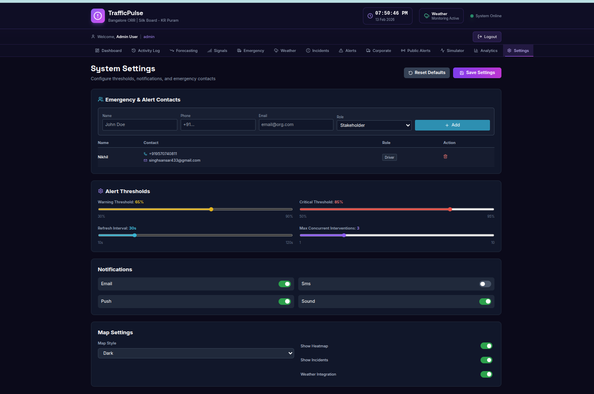

> **Full system configuration** — emergency & alert contacts management, alert thresholds (warning/critical) with sliders, notification channel toggles (Email, SMS, Push, Sound), map style preferences, and feature toggles for heatmap, incidents, and weather integration.

---

## 🛠️ Tech Stack

| Layer        | Technologies                                                        |
| ------------ | ------------------------------------------------------------------- |
| **Frontend** | Next.js 16, React 19, TailwindCSS, Chart.js, Leaflet/Google Maps    |
| **Backend**  | Next.js API Routes, Socket.IO                                       |
| **Database** | MongoDB Atlas                                                       |
| **AI**       | Google Gemini API                                                   |
| **APIs**     | Google Maps, Mapbox, OpenRoute Service, WeatherAPI, Twilio, Twitter |

## 🚀 Project Setup

### Prerequisites

- Node.js 18+
- MongoDB Atlas account (or local MongoDB)
- API keys (see [Environment Variables](#-environment-variables))

### 1. Clone the Repository

```bash
git clone https://github.com/HARShaaYadav/traffic-pulse.git
cd traffic-pulse
```

### 2. Install Dependencies

```bash
npm install
```

### 3. Configure Environment Variables

```bash
cp example.env .env.local
```

Open `.env.local` and fill in your actual API keys. At minimum you need:

- `MONGODB_URI` — Your MongoDB connection string
- `JWT_SECRET` — Any secure random string
- `GOOGLE_MAPS_API_KEY` — For map visualization
- `GEMINI_API_KEY` — For AI-powered recommendations

### 4. Clean Database & Seed Admin

Before first run (or before deploying), clear any existing data and seed the admin user:

```bash
# Step 1: Clear all existing data from the database
node -e "require('dotenv').config({path:'.env.local'}); require('./scripts/clear-data.js')"

# Step 2: Seed the default admin user
node -e "require('dotenv').config({path:'.env.local'}); require('./scripts/seed.js')"
```

This will:

- Remove all old traffic snapshots, alerts, incidents, and simulations
- Create the default admin account:
  - **Email**: `admin@traffic.com`
  - **Password**: `admin123`
  - **Role**: `admin`

### 5. Run the Development Server

```bash
npm run dev
```

Open [http://localhost:3000](http://localhost:3000) to view the app.

### 6. (Optional) Run with Socket.IO Server

For real-time WebSocket updates:

```bash
npm run dev:custom
```

## 🚢 Deployment Checklist

Before deploying to production:

1. **Set environment variables** on your hosting platform
2. **Clean the database**:
   ```bash
   node -e "require('dotenv').config({path:'.env.local'}); require('./scripts/clear-data.js')"
   ```
3. **Seed the admin user**:
   ```bash
   node -e "require('dotenv').config({path:'.env.local'}); require('./scripts/seed.js')"
   ```
4. **Build the project**:
   ```bash
   npm run build
   ```
5. **Start the server**:
   ```bash
   npm start
   ```

## 🔑 Environment Variables

See `example.env` for all required configuration:

| Service     | Required | Purpose               |
| ----------- | -------- | --------------------- |
| MongoDB     | ✅       | Database              |
| JWT Secret  | ✅       | Authentication        |
| Google Maps | ✅       | Map visualization     |
| Gemini AI   | ✅       | AI recommendations    |
| Mapbox      | Optional | Alternative map tiles |
| OpenRoute   | Optional | Emergency routing     |
| WeatherAPI  | Optional | Weather integration   |
| Twilio      | Optional | SMS alerts            |
| SMTP        | Optional | Email alerts          |
| Twitter     | Optional | Social media alerts   |
| Firebase    | Optional | Push notifications    |

## 🔐 Demo Credentials

- **Email**: `admin@traffic.com`
- **Password**: `admin123`
